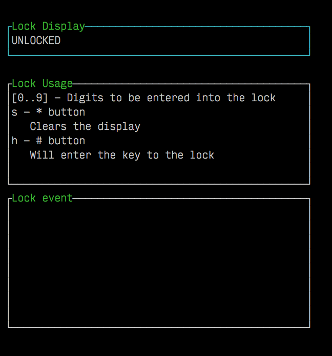
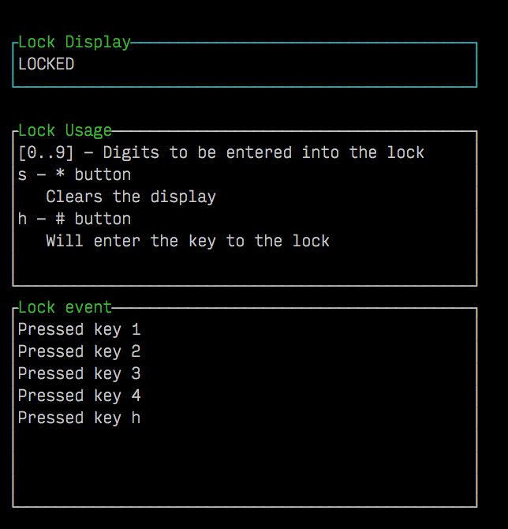
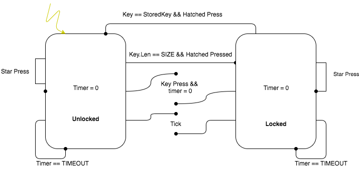

# Lock FSM Problem
| Default lock display | Example Lock usage |
| :-----: | :-----: |
|  |  |

## Problem Definition

- [ ] When a lock has been initialised
  - Then the lock should be unlocked
- [ ] Given a user has entered a four digit key
  - And presses the '#' key
  - And the lock was previously unlocked
  - Then the lock should displays 'LOCKED'
- [ ] Given a user has entered a four digit key
  - And it was the same key entered to lock
  - And has pressed '#'
  - Then it should display 'UNLOCKED'
- [ ] Given that no keys have been pressed in the last 10 seconds
  - Then the lock should clear the current buffer
  - And goes back to its previous state.
- [ ] Given that the '\*' has been pressed
  - Then the lock should go back to its previous state

## Extension Problem
- [ ] Given that the keypad has been inactive for 15 seconds
  - Then the display should _turn off_(display nothing)
- [ ] Given that keypad is locked
  - And there has been three failed attempts
  - Then the keypad should go into _cooldown_ mode for 8 seconds
  - And disable the keypad

### Meerly Moore State Machine


## Where to Start
Inside [here](problem/) we have written some boiler plate code.
Please feel free to refer back to this if you need or ask questions.

This problem allows you to test through a terminal UI so you will need some extra
packages.
```sh
# Downloading any extra packages needed
go get -v -d ./...
```

## Testing your code
We have written some [tests](test/) to ensure that you have implemented a solution to our problem correctly.

```sh
# To run all of our test cases
go test -v ./...
```
