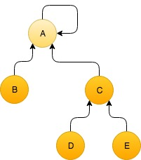

# Nearest Relative Problem

## Problem Definition
We are trying to find the closest relative between two people. We assume that the oldest relative has no other relatives but themselves. (As seen in the example).



|First Person | Second Person | The Closest Relative|
|-------------| --------------| --------------------|
| A           | A             | A                   |
| A           | B             | A                   |
| E           | B             | A                   |
| D           | E             | C                   |

## Where to Start
Inside [here](problem/) we have written some boiler plate code. Please feel free to refer back to this if you need or ask questions.

## Testing your code
We have written some [tests](test/) to ensure that you have implemented a solution to our problem correctly.

```sh
# To run all of our test cases
go test -v ./...
```
